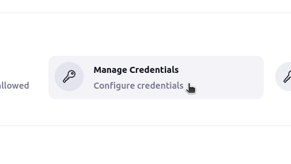
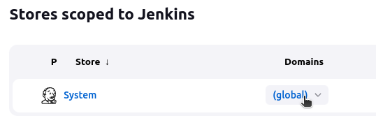
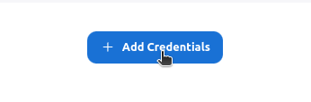
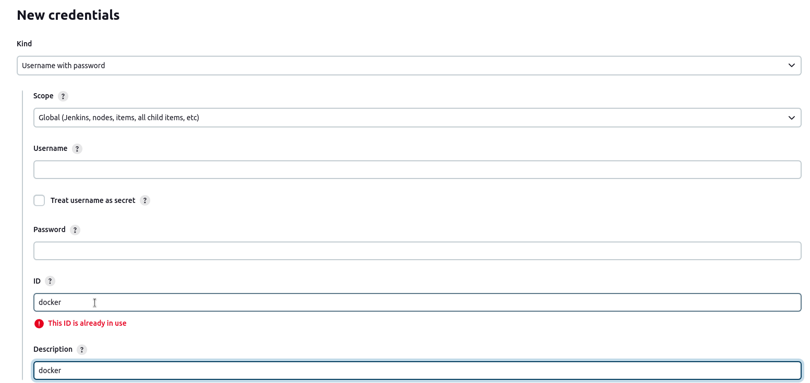
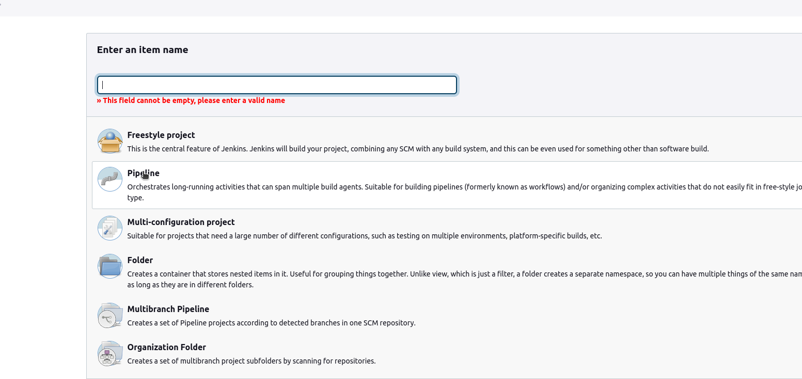
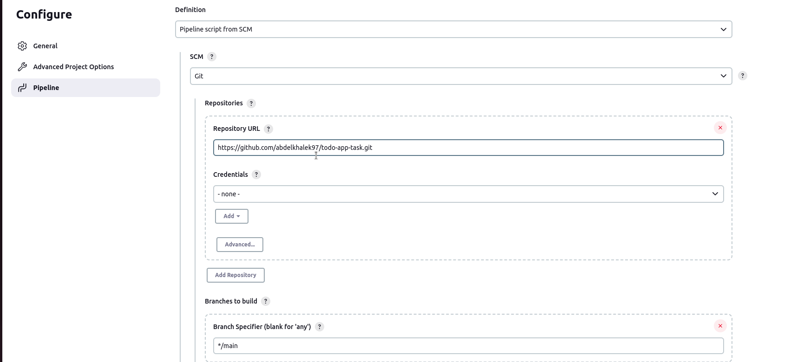
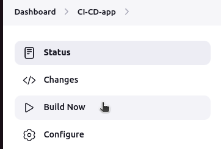
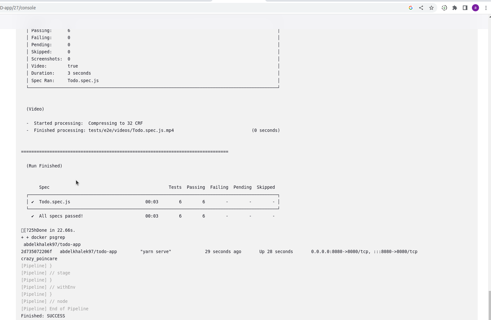
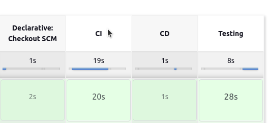
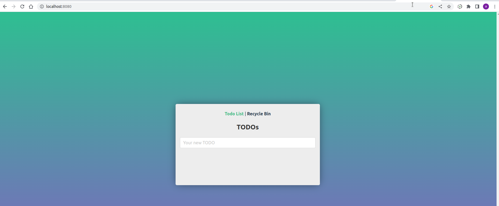

# Todo-App

This is a repo used in a jenkins pipeline to CI/CD and testing simple node application .\
application used : https://github.com/dobromir-hristov/todo-app
- custom jenkins image that has docker installed.
- The application is deployed on the local machine ip and port 8080.
- The application is tested using Unit: Jest + Vue Test Utils and E2E: Cypress.

### Installing Jenkins

Run custom jenkins image in detached mode on port 8081 and attaching docker daemon to the container.
```
docker run -d -p 8081:8080 -v /var/run:/var/run -v jenkins_home:/var/jenkins_home abdelkhalek97/custom-jenkins
```
- Jenkins will be running on machine localhost on port 8081 , if the port is already used please chose another.
- http://localhost:8081/

#### Configuring Jenkins
- Add docker logging credentials by navigatiing to manage jenkins -> manage credentials -> global -> add credentials.\
\
\
\


- Now navigate to new item and choose pipeline type.

- Insert git repo link : https://github.com/abdelkhalek97/todo-app-task.git 
- Choose main branch.

- Save and build now.\
\
\


### Application
- http://localhost:8080/
- application will be running on machine localhost on port 8080.\


### Note
- CustomJenkins is the Dockerfile code that was used to build jenkins custom image.
- In case of running a container of the todo app:
```
docker run -d -p 8080:8080 abdelkhalek97/todo-app
```
- make sure that port 8080 isn't used or chose another port
